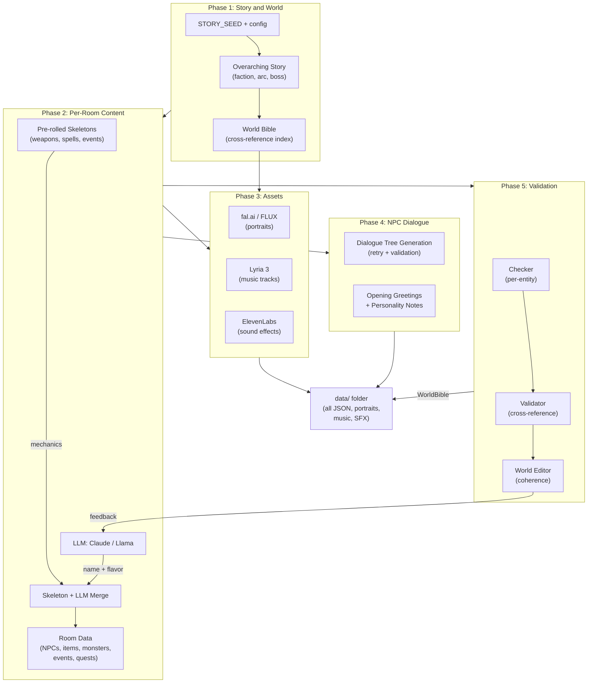
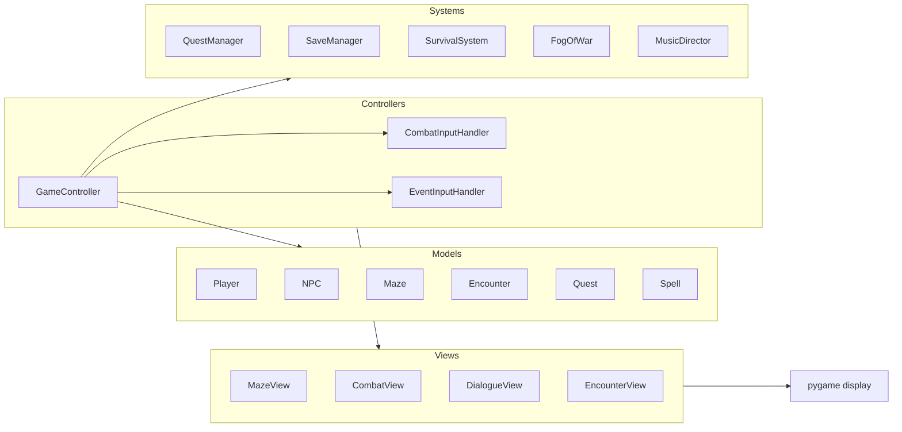

# MazeWorld -- GenAI-Orchestrated Game World Generation

A fully AI-generated dungeon RPG where every entity -- NPCs, monsters, items, quests, story arcs, portraits, music, and sound effects -- is created by an orchestrated pipeline of generative AI models. The result is a playable 2D overhead RPG with turn-based combat, multi-room exploration, and LLM-driven NPC dialogue.

## GenAI Architecture

**Multi-Model Pipeline** -- World generation orchestrates 5 AI modalities across a single pipeline run. Each modality supports swappable backends:

| Modality | API Backend | Local Backend |
|----------|------------|---------------|
| Text / Story | Claude 3.5 (Anthropic) | Llama 3.2 3B (HuggingFace) |
| Portraits | fal.ai (nano-banana) | FLUX.1 (CUDA) / SDXL Turbo (MPS) |
| Music | Google Lyria 3 | -- |
| SFX | ElevenLabs | -- |
| Narrative | Claude (summary agent) | Llama 3.2 |

**Agentic Validation Pipeline** -- Generated content passes through a three-stage validation architecture: Checker (per-entity structural validation), Validator (cross-reference integrity), and World Editor (world-coherence audit). Failed entities trigger LLM re-generation with structured feedback. Validation uses domain-specific structural checks rather than schema-only validation, enabling game-logic constraints like puzzle solvability, quest-target existence, and circular dependency detection.

**Provider Abstraction** -- All AI backends implement abstract interfaces (`LLMBackend`, `ImageBackend`) with a singleton registry for lazy resolution. Prompts are decoupled from backends via `PromptSet` -- each model family gets optimized prompt formatting while sharing the same `LLMRequest` envelope.

**Skeleton-Driven Generation** -- Mechanical properties (weapon dice, spell stats, encounter DCs) are pre-rolled as skeletons before the LLM call. The LLM generates only name and flavor text, then skeletons are merged back. This ensures balanced gameplay while preserving creative variety.

### Generation Pipeline



### Runtime Architecture



## Three-Mode Architecture

| Mode | `.env` value | Description |
|------|-------------|-------------|
| **Offline (Static)** | `offline_static` | Pre-generated content with scripted dialogue trees. Fully self-contained, no API keys needed. |
| **Offline (Local)** | `offline_local` | NPC dialogue generated by locally hosted LLM. Requires local GPU. |
| **Online (API)** | `online` | NPC dialogue generated via Claude API. Requires internet + API key. |

## Game Features

**Combat and Progression**
- 4 class archetypes (warrior, mage, healer, jester) with GenAI-generated names, stats, and portraits per environment
- Turn-based combat: initiative, melee/magic attacks, weapon stat scaling, spell stat modifiers
- 5-element magic system (fire, water, forest, light, dark) with rock-paper-scissors multipliers
- Level-up system with class-specific ability and spell pools that scale with room level
- Jester's Gamble: LUCK-influenced random effect table; mystery pick at character select

**World and Exploration**
- Multi-room maze exploration with fog of war and day/night cycle
- 3 encounter types: combat (monster fights), puzzle (tool/ability/spell solutions), event (multi-choice + dice checks with stat modifiers)
- Environment-themed monster pools with level-scaled stats, elemental affinities, and loot tables
- Gate bosses guarding room transitions; climax boss on the final room
- Save/load system, survival mechanics (hunger, thirst, stamina), item shops

**Story and NPCs**
- Overarching story from configurable `STORY_SEED` -- faction, escalation arc, per-room beats, final boss
- 6 quest types: fetch, kill, escort, delivery, dialogue, multi-step chains
- NPC dialogue: pre-generated dialogue trees (offline) or live Claude conversation (online) with personality injection
- Follower system with quest-linked companions, dialogue, and farewell on completion
- GenAI-generated portraits, music tracks, and sound effects for all entities and screens

## Project Stats

- **62,000+** lines of Python
- **998** tests across 40 test files (pytest, ruff, GitHub Actions CI)
- **5** AI modalities orchestrated in a single pipeline
- **3** runtime modes (offline static, offline local, online API)

## Setup

```bash
pip install -r requirements.txt
cp .env.example .env   # then edit with your values
```

See `.env.example` for configuration options including `GAME_MODE`, `LLM_BACKEND`, `IMAGE_BACKEND`, `STORY_SEED`, and API keys.

## Running

```bash
# Full run (generates world content, then launches game)
python main.py --dev

# Skip generation (use existing data/)
python main.py --dev --skip-gen
```

## Requirements

- Python 3.11+
- Pygame 2.6
- Pydantic 2.9+
- Anthropic SDK (for online mode)
- PyTorch 2.4+, Transformers, Diffusers (for local mode only)

See `requirements.txt` for pinned versions.

## License

See [LICENSE](LICENSE).
