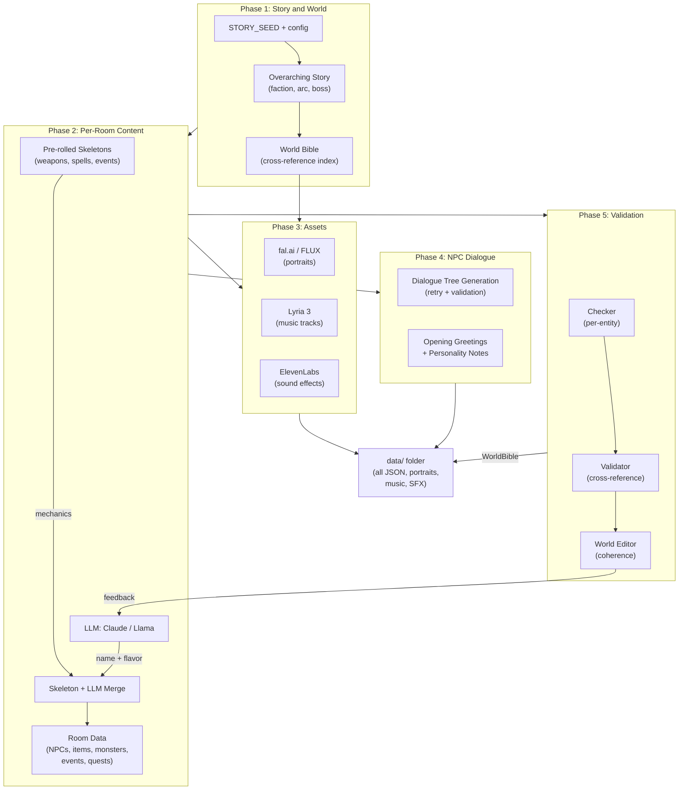
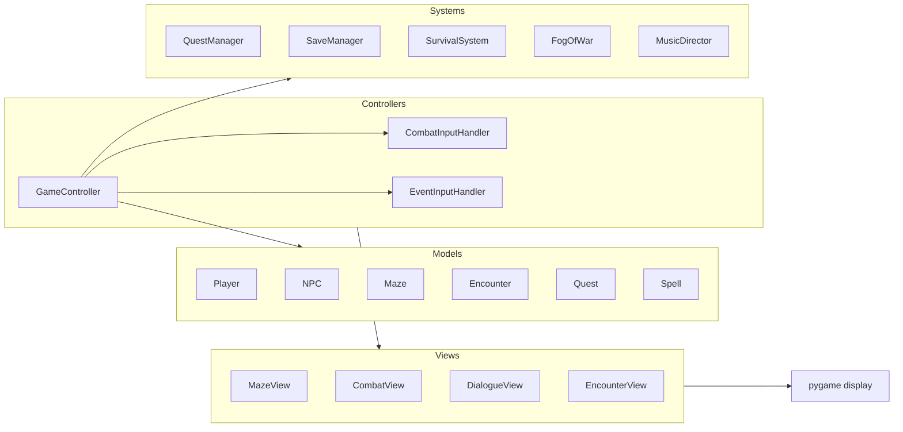

# MazeWorld — GenAI-Orchestrated Game World Generation

**A 2D RPG where every NPC, item, weapon, quest, portrait, music track, and sound effect is generated by AI.** One input — a `STORY_SEED` string — produces a playable, coherent world through a pipeline that orchestrates five AI modalities. Turn-based combat, multi-room exploration, LLM-driven NPC dialogue.

### ▶ Play it now

**[Download MazeWorld.app (macOS arm64, ~455MB)](https://drive.google.com/file/d/1Bl5pt2WeFYGRUbwMpR_EeNpY7jtd_A3y/view?usp=sharing)** — no install, no API keys, no Python. Double-click to play a 2-room run.

> First launch on macOS: the app is unsigned, so run `xattr -cr MazeWorld.app && open MazeWorld.app` once to clear the Gatekeeper quarantine.

<!-- Optional: drop a 15-30s gameplay GIF here. Lands the pitch in the first screen. -->
## GenAI Architecture

**Multi-Model Pipeline** — World generation orchestrates 5 AI modalities across a single pipeline run, with the ability to run locally and generate with local resources/models.

| Modality | API Backend | Local Backend |
|----------|------------|---------------|
| Text / Story | Claude Sonnet 4 (Anthropic) | Llama 3.2 3B (HuggingFace) |
| Portraits | fal.ai (nano-banana) | FLUX.1 (CUDA) / SDXL Turbo (MPS) |
| Music | Google Lyria 3 | — |
| SFX | ElevenLabs | — |
| Narrative | Claude | Llama 3.2 |

**Agentic Validation Pipeline** — Generated content passes three audits:

1. **Checker** — per-entity structural validation (required fields, type constraints, puzzle solvability).
2. **Validator** — cross-reference integrity (every quest target exists, every item reference resolves, no circular dialogue dependencies).
3. **World Editor** — coherence audit against the World Bible.

On failure, the specific failure reason is fed back to the LLM as context for the retry. This one pattern did more for quality than switching models did.

**Skeleton-Driven Generation** — Mechanical properties (weapon dice, spell stats, encounter DCs) are pre-rolled as skeletons before the LLM call. The LLM generates only name and flavor text, then skeletons are merged back. This ensures balanced gameplay while preserving creative variety.

### Generation Pipeline



### Runtime Architecture



## Three-Mode Architecture

| Mode | `.env` value | Description |
|------|-------------|-------------|
| **Offline (Static)** | `offline_static` | Pre-generated content with scripted dialogue trees. Fully self-contained, no API keys needed. |
| **Offline (Local)** | `offline_local` | NPC dialogue generated by locally hosted LLM. Requires local GPU. |
| **Online (API)** | `online` | NPC dialogue generated via Claude API. Requires internet + API key. |

## Game Features

- Multi-room maze exploration with fog of war and day/night cycle
- Turn-based combat with initiative, weapon stat scaling, spell modifiers
- 4 class archetypes (warrior, mage, healer, jester) with AI-generated stat blocks, names, and portraits per environment
- 5-element magic system (fire, water, forest, light, dark) with RPS multipliers
- 3 encounter types: combat, puzzle (tool / ability / spell solutions), event (multi-choice with DC rolls)
- 6 quest types: fetch, kill, escort, delivery, dialogue, multi-step chains
- Environment-themed monster pools with elemental affinities and loot tables
- Gate bosses per room, climax boss on the final room
- NPC followers, shops, survival (hunger / thirst / stamina), save/load

## Quick start (from source)

```bash
git clone <repo>
cd mazeworld
pip install -e ".[api,dev]"
cp .env.example .env            # add keys for any providers you want
python main.py --dev            # generate a world, then play it
python main.py --dev --skip-gen # play an already-generated world
```

## Building the `.app` yourself

From a generated world:

```bash
python main.py --dev --exe
```

PyInstaller needs a framework-built Python on macOS, so the `--exe` flag uses a separate `.venv-build`:

```bash
/Library/Frameworks/Python.framework/Versions/3.12/bin/python3 -m venv .venv-build
.venv-build/bin/pip install 'pygame>=2.6' 'pydantic>=2.9' 'python-dotenv>=1.1' \
                             'Pillow>=10.0' 'protobuf>=4.25' 'pyinstaller>=6.11'
```

Requires Python 3.12 from [python.org](https://www.python.org/downloads/macos/). Saves from the packaged app live at `~/Library/Application Support/MazeWorld/saves/` (including `crash.log` on failed launches).

## Requirements

- Python 3.11+
- Pygame 2.6, Pydantic 2.9+
- Anthropic SDK (online mode)
- PyTorch 2.4+, Transformers, Diffusers (offline_local mode only)

See `requirements.txt` for pinned versions.

## License

[MIT](LICENSE).
